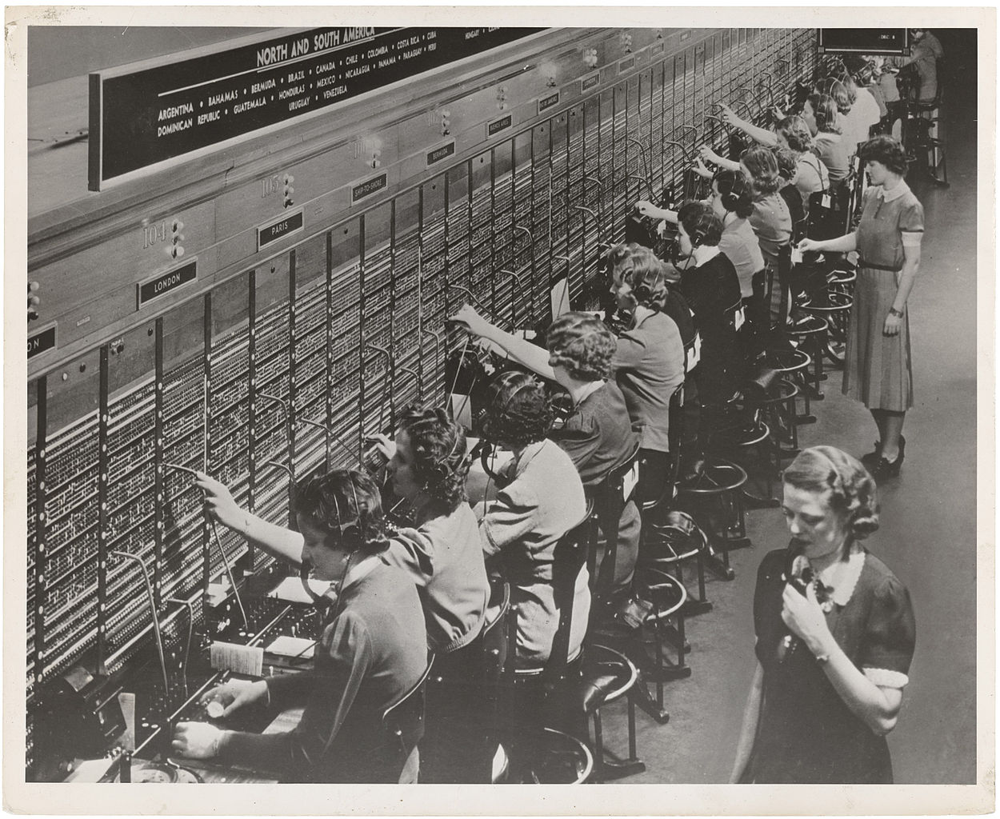
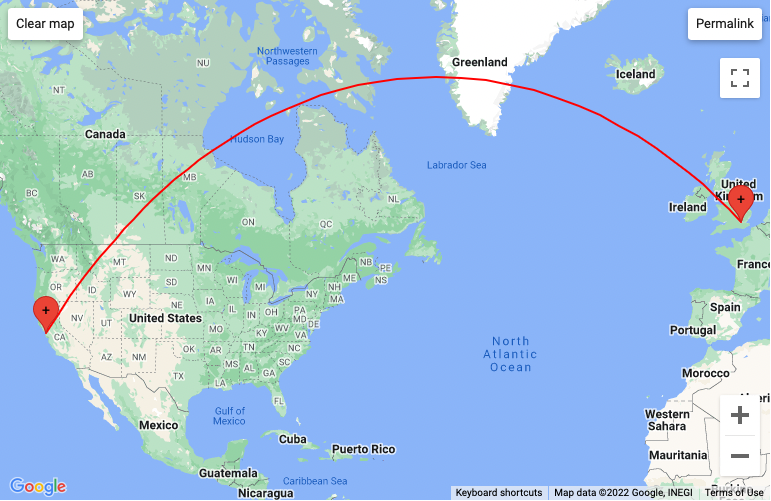
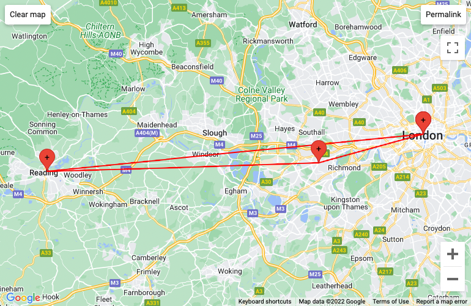

# Traceroute

Learn to explain how computers route information over a network.

[Video Alternative](https://www.youtube.com/watch?v=wAE-VFCr_dQ&t=689s)

## The question: How do computers route information over a network?

You've probably figured out that there isn't a cable connecting every single
computer in the world into every other one. That would be impossible!

Let's look at another piece of technology which will get us a step closer to
that answer: the telephone.

To dramatically simplify things — the telephone was invented by taking a long
cable and replacing the Morse code keys with speakers and microphones. This was
very popular — most people can speak and hear, whereas very few could use Morse
code.

So there were a lot of telephones. It wasn't really practical to connect each
telephone to every other telephone, so they invented a system called **circuit
switching**.



This is a telephone switchboard. It is a big wall with a lot of holes
('sockets') in it. Each socket is connected to a particular telephone or other
operator. Operators — mostly women — used cables to connect person A's telephone
to person B's telephone so they can speak together.

[Take a look at this video to see an operator talk through how telephone
switchboards worked.](https://youtu.be/aYkh6BrsPpQ?t=27)

Eventually, these switchboards were automated. [Here's an example of someone
talking through how the automated systems
worked.](https://www.youtube.com/watch?v=bvPH-tsD9ZM)

Manual or automated, these systems worked by having exchanges that **switched**
cables to create a **route** for a **direct connection** (electrical circuit)
from point A to point B.

To get a bit closer to computers, let's take a look at a diagram of a network:


Imagine the smaller nodes as individual telephones, and the big nodes as
telephone exchanges. The people running these exchanges take calls from their
small nodes and try to get them routed to where they want to go.

Let's imagine D1 wants to call G3. Let's trace a route between them so they can
chat.


That works, but it's not the only option. We might just as easily have gone via
FX. There are multiple paths through the network to get to the destination.

Let's imagine that, at the same time, E1 wants to talk to G1 and H3 wants to
speak to D2.


Things are starting to get a little busy! You'll notice that all the cables
between DX and EX are now in-use.

Now let's imagine that E2 wants to speak to D3. We can't use any of the cables
between DX and EX anymore, so the operators have to think creatively. They might
instead take the route via FX.


In this way, the route between points in the network can adapt to different
conditions. If one route is very busy then other routes can be taken. Similarly,
if one exchange breaks down, or a link is severed, the network can take other
routes to adapt.

The Internet works in a similar way. Your computer connects to a router in your
house, then to a big router in your Internet Service Provider, and then onto
other Internet infrastructure and finally to wherever you want to contact. The
Internet also regularly adapts based on the most efficient and accessible paths
for traffic at a particular time.

There is another layer of technology on top of this which we will cover in the
next step. For now, let's look at a tool we can use to observe these routes.


## The tool: Traceroute

Let's run `man traceroute` and see what we get:

```
TRACEROUTE(8)                System Manager's Manual               TRACEROUTE(8)

NAME
     traceroute – print the route packets take to network host

SYNOPSIS
     traceroute [-adeFISdNnrvx] [-A as_server] [-f first_ttl] [-g gateway]
                [-i iface] [-M first_ttl] [-m max_ttl] [-P proto] [-p port]
                [-q nqueries] [-s src_addr] [-t tos] [-w waittime]
                [-z pausemsecs] host [packetsize]

DESCRIPTION
     The Internet is a large and complex aggregation of network hardware, 
     connected together by gateways. Tracking the route one's packets follow
     (or finding the miscreant gateway that's discarding your packets) can be
     difficult. traceroute utilizes the IP protocol 'time to live' field and
     attempts to elicit an ICMP TIME_EXCEEDED response from each gateway along
     the path to some host.
```

"Print the route packets take to network host" — OK, let's try it:

_This command can take some time to run._

```shell
; traceroute makers.tech
traceroute: Warning: makers.tech has multiple addresses; using 172.67.136.42
traceroute to makers.tech (172.67.136.42), 64 hops max, 52 byte packets
 1  hirouter.net (192.168.8.1)  7.623 ms  3.482 ms  3.365 ms
 2  * * *
 3  172.17.69.97 (172.17.69.97)  38.656 ms  17.629 ms  20.007 ms
 4  * * *
 5  * * *
 6  172.17.166.117 (172.17.166.117)  50.152 ms
    172.17.166.113 (172.17.166.113)  21.508 ms  26.190 ms
 7  * * *
 8  * 172.17.20.42 (172.17.20.42)  44.073 ms  15.345 ms
 9  * * *
10  141.101.71.20 (141.101.71.20)  58.938 ms  23.593 ms  20.005 ms
11  172.70.87.2 (172.70.87.2)  18.611 ms
    172.70.160.2 (172.70.160.2)  14.825 ms
    172.70.87.2 (172.70.87.2)  27.601 ms
12  172.67.136.42 (172.67.136.42)  31.538 ms  19.031 ms  15.539 ms
```

The above is the list of the addresses of the computers the data I send to
`makers.tech` passes through on its way. Your `traceroute` will be different.

You will notice some of them are just `* * *` — this means the server wasn't
interested in being traced and wouldn't respond to our requests. That's OK —
some servers don't respond to `ping` either. They're focused on other things.

The first one will be the address of the router in your home, or whatever router
your computer is directly connected to.

The IP addresses are cool to look at and all, but it's also possible to find out
roughly where they are geographically. This means we can make a map of the route
our packets follow through the Internet. 

<details>
  <summary>:speech_balloon: Wait, what — so my IP address can tell someone where I am?</summary>

  ---

  Roughly yes. It's typically not very precise, but it does reveal some
  information so you may wish to think carefully about sharing your IP address
  with anyone who you wouldn't share, for example, your postcode with.

  Typically any website you visit will get your IP address so it knows where to
  send the data you requested, so it's not exactly your National Insurance
  number but it does still reveal some information.

  ---

</details>

Open up the website [Traceroute
Mapper](https://stefansundin.github.io/traceroute-mapper/), put either your
traceroute or the sample one above into the box, and hit the button.

> **Note**  
> If you want to look at one route and then another, make sure you refresh the
> page or click 'Clear map' between or you will be looking at both routes at
> once.

Here's the sample one:



It isn't very detailed, but you should be able to see a route from roughly your
location to the Makers HQ in San Francisco.

_But wait,_ I hear you say, _Makers HQ is in London!_ True, at least for now.
But if you play with traceroute a bit you will find that a lot of the Internet
is centralised in the United States.

Let's look at Google:

```shell
; traceroute google.com
traceroute to google.com (142.250.180.14), 64 hops max, 52 byte packets
 1  hirouter.net (192.168.8.1)  5.838 ms  11.070 ms  3.373 ms
 2  * * *
 3  172.17.69.97 (172.17.69.97)  46.213 ms  25.081 ms  21.049 ms
 4  * * *
 5  * * *
 6  172.17.166.113 (172.17.166.113)  33.686 ms
    172.17.166.117 (172.17.166.117)  26.036 ms
    172.17.166.113 (172.17.166.113)  24.801 ms
 7  * * *
 8  172.17.17.146 (172.17.17.146)  38.318 ms  19.436 ms  20.007 ms
 9  185.153.237.152 (185.153.237.152)  22.373 ms *
    142.250.162.45 (142.250.162.45)  43.257 ms
10  185.153.238.159 (185.153.238.159)  26.036 ms
    185.153.237.155 (185.153.237.155)  26.124 ms
    142.250.162.44 (142.250.162.44)  22.798 ms
11  * * *
12  142.251.54.24 (142.251.54.24)  20.566 ms
    142.251.54.29 (142.251.54.29)  23.131 ms
    142.250.215.124 (142.250.215.124)  15.485 ms
13  74.125.242.114 (74.125.242.114)  15.951 ms
    74.125.242.115 (74.125.242.115)  29.771 ms
    142.251.54.31 (142.251.54.31)  25.844 ms
14  216.239.57.207 (216.239.57.207)  69.696 ms
    lhr25s32-in-f14.1e100.net (142.250.180.14)  20.743 ms  14.801 ms
```



Huh? From London, to Reading, then Richmond and back to London again? As I
mentioned, these geographic locations are a bit imprecise so we can expect some
noise, but this one doesn't go to the USA at all! Is Google hosted in London
then?

The answer is — sort of. But we'll come to that later. For now, let's have some
fun with traceroute.

## Investigations

_These exercises are marked with :hot_pepper: emojis to denote how challenging
they are. A single chilli :hot_pepper: is the most straightforward, and five
:hot_pepper::hot_pepper::hot_pepper::hot_pepper::hot_pepper: would be
challenging even for a professional engineer. Pick whichever you prefer._

This is a set of questions you can investigate to learn more. Pick the ones that
interest you.

* :hot_pepper: How can we use `traceroute`s `-q` flag to speed up tracing a
  route?
* :hot_pepper::hot_pepper: What does the `-r` flag for `traceroute` do? What
  about on `ping`? When might it be useful?
* :hot_pepper::hot_pepper: The time it takes for data to get from one place to
  another is called latency. Very low latency connections are desirable by
  various groups, but for High Frequency Trading in the finance industry it can
  mean huge sums of money. What techniques do High Frequency Trading systems use
  to minimise latency?
* :hot_pepper::hot_pepper: Try to trace a route between your computer and every
  continent on Earth. Which continents are easy or hard to reach — and why?
* :hot_pepper::hot_pepper::hot_pepper: How does `traceroute` actually work out
  routes? What is a 'ttl'? What is a 'time exceeded' reply?


[Next Challenge](03_telnet_bite.md)

<!-- BEGIN GENERATED SECTION DO NOT EDIT -->

---

**How was this resource?**  
[😫](https://airtable.com/shrUJ3t7KLMqVRFKR?prefill_Repository=makersacademy%2Fcloud-deployment&prefill_File=01_internet%2F02_traceroute_bite.md&prefill_Sentiment=😫) [😕](https://airtable.com/shrUJ3t7KLMqVRFKR?prefill_Repository=makersacademy%2Fcloud-deployment&prefill_File=01_internet%2F02_traceroute_bite.md&prefill_Sentiment=😕) [😐](https://airtable.com/shrUJ3t7KLMqVRFKR?prefill_Repository=makersacademy%2Fcloud-deployment&prefill_File=01_internet%2F02_traceroute_bite.md&prefill_Sentiment=😐) [🙂](https://airtable.com/shrUJ3t7KLMqVRFKR?prefill_Repository=makersacademy%2Fcloud-deployment&prefill_File=01_internet%2F02_traceroute_bite.md&prefill_Sentiment=🙂) [😀](https://airtable.com/shrUJ3t7KLMqVRFKR?prefill_Repository=makersacademy%2Fcloud-deployment&prefill_File=01_internet%2F02_traceroute_bite.md&prefill_Sentiment=😀)  
Click an emoji to tell us.

<!-- END GENERATED SECTION DO NOT EDIT -->
