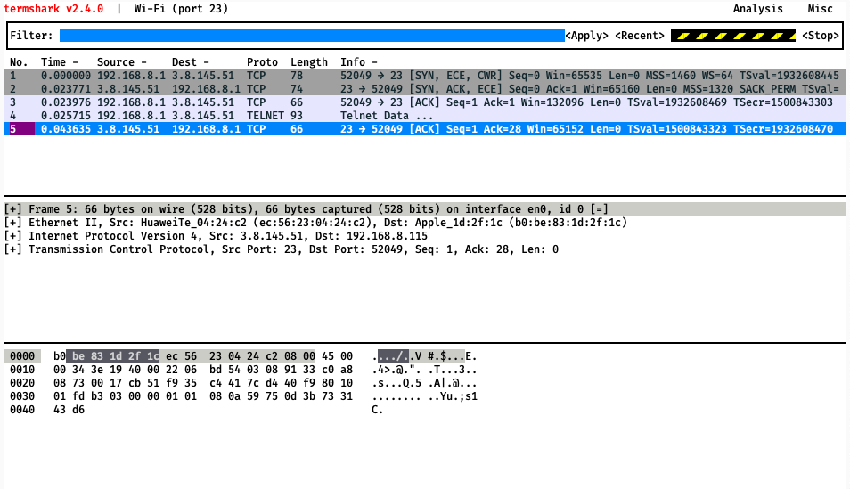

# Telnet

Learn to explain how computers share a common physical connection.

[Video Alternative](https://www.youtube.com/watch?v=5dDqQWkEKzU&t=0s)

## The question: How do computers share a common physical connection?

You might have heard of the idea of cyberspace. It conjures images of cool kids
surfing through virtual environments, fighting viruses and such. The Internet
isn't really like that, but here is a grain of truth in this idea. A lot of the
Internet isn't strictly 'real'.

We saw before how having an individual cable between every person would be
impossible, and how circuit switching enabled the use of central exchanges to
create direct connections through a network only when needed.

For a project like the Internet even circuit switching isn't enough. A computer
might need to establish tens, hundreds, or even thousands of connections to
other computers simultaneously. If we needed to establish direct electrical
circuits for all of those it would be extremely challenging and practically very
slow.

To address this, another approach was devised called **packet switching**. This
approach is used to create virtual (fake) connections between computers.

Packet switching involves simulating connections by breaking down communication
into little parcels of data called packets. These packets are given an address
to go to, and then sent down a common cable to a network of routers which then
forwards them on to their destination.

Here's a simplified example. Let's imagine two people are chatting:

```markdown
_Chat started between Eddie and Kay_
Eddie: Oops
Eddie: I just discovered the shortcut key for starting a huddle
Kay: ahaha
Kay: what is it?
Eddie: Some random keys I hit by mistake
Eddie: cmd+shift+h. No idea why I pressed those keys
```

The packets might look like this:

```
PACKET 1
TYPE: CHAT
FROM: Eddie
TO: Kay
MESSAGE: Oops

PACKET 2
TYPE: CHAT
FROM: Eddie
TO: Kay
MESSAGE: I just discovered the shortcut key for starting a huddle

PACKET 3
TYPE: CHAT
FROM: Kay
TO: Eddie
MESSAGE: ahaha

PACKET 4
TYPE: CHAT
FROM: Kay
TO: Eddie
MESSAGE: what is it?

PACKET 5
TYPE: CHAT
FROM: Eddie
TO: Kay
MESSAGE: Some random keys I hit by mistake

PACKET 6
TYPE: CHAT
FROM: Eddie
TO: Kay
MESSAGE: cmd+shift+h. No idea why I pressed those keys
```

You might not see what's so special about that yet. We'll explore the benefits
throughout this step, but for now:

Recall that with circuit switching we needed to create a dedicated electrical
circuit between the source and destination. Packet switching opens up other
opportunities. Instead of dedicating a single circuit, everyone can have one
connection to a central 'routing' computer. They can send their packets to this
router with the destination address and then that router can forward them on to
the destination.

Now, we only need one cable linking each computer to the router. Even better,
that cable could actually be used to communicate with multiple other computers
at once. Kay might have a chat open with several other people at the same time.
Each chat would generate packets with different addresses which would then be
forwarded through routers onto their destination.

We'll take a look into how this works in practice now, but we'll review again at
the end.

## The tools: Telnet and Termshark

We're going to observe packet switching and virtual connections using two tools:
`telnet` to establish a connection, and `termshark` to observe what packets are
actually being sent.

We'll need to install them both:

```shell
; brew install telnet
; brew install termshark
```

### Telnet

Let's take `telnet` for a spin before we look at its packets.

```shell
; telnet xf.mkrs.link
```

This starts `telnet` to connect to a test server that the Makers team has set
up. After a moment you should see a message saying we are connected:

```
Connected to xf.mkrs.link.
Escape character is '^]'.
```

At this point, type in "Hello World" and hit enter. You should see:

```
Hello World
Uryyb Jbeyq
```

This server just replies a distorted version of the text you send it. Try a few
other strings if you like. When you're done, press `ctrl+]` (that's what `^]`
means) and then type `quit` or hit `ctrl+c` to close `telnet`.

```
^]
telnet> quit
Connection closed.
```

<details>
  <summary>:confused: I can't exit `telnet`!</summary>

  ---

  Make sure you are pressing `ctrl+]` first. `ctrl+c` inside `telnet` won't
  work, it will assume you are trying to send `ctrl+c` to the server!

  ---

</details>

Not very impressive perhaps. The key thing to take from this is:

**Telnet establishes a connection to a remote server.** In a sense, it is
pretending that there is a dedicated cable connecting the two computers.

However, unlike in a circuit switched phone network, this connection is not
real. It is a **virtual** connection. We'll see how packets are used to create
this virtual connection using `termshark`.

## Termshark

First, we'll start `termshark`. Make sure you've exited `telnet` and then run:

```shell
; sudo termshark -f "port 23"
(The termshark UI will start when packets are detected...)
```

<details>
  <summary>:speech_balloon: Could you break down what that command does?</summary>

  ---

  Yes.

  * `sudo` switches into superuser mode. We need to do this because only the
    superuser on a particular computer is allowed to monitor the packets that
    computer sends and receives.
  * `termshark` is a terminal application that will take a look at packets as
    they are sent and received and then show them to us.
  * `-f "port 23"` applies a filter to only look at packets related to `telnet`. 

  A port is a metaphorical 'socket' on a computer, a bit like those sockets in
  the telephone exchange. Each one has a number. Using different ports allows a
  computer to establish multiple connections at once, even to the same computer.
  Some port numbers have a special meaning — for example, port 23 is the port
  used for `telnet`, port `80` is used for unencrypted HTTP.

  If you wanted to look at all packets, you can run `sudo termshark` instead. Be
  warned though, there are a lot of them!

  ---

</details>

Now let's start `telnet` again. Bring up another terminal alongside the one with
`termshark` in it **so that you can see both at the same time**, and then run:

```shell
; telnet xf.mkrs.link
```



There's a lot of information here. I'll draw your attention to the key parts —
you can tune out the rest.

At the top there is a list of packets that have been sent and received. You can
use the up and down arrow keys to highlight particular packets.

This changes the information in the two panels below. The bottom panel shows you
the raw data of the packet — this is what is really sent over the Internet. The
middle panel shows you a human-readable interpretation. You can hit tab to move
around which panel is focused. 

If you focus the middle panel you can use the up and down arrows to move between
sections, and the right and left arrows to open and close different sections.
This then highlights in the data panel beneath what data corresponds to the
information you've highlighted.

<details>
  <summary>🦈 Oh my gosh there's a shark swimming across the screen!</summary>

  ---

  Regrettably yes. If you switch away from the `termshark` window for long
  enough it simulates a shark swimming across the terminal. You can click back
  into the window to make it stop. 
  
  It is a bit distracting but fortunately it won't bite.

  ---

</details>

We can see that establishing the connection involves sending a few packets back
and forth. These packets aren't so important to us right now so we'll skip over
them. If you'd like a deep dive, there will be a video at the end of this
section.

Let's send some data in `telnet`. Type in "Hello world!" and hit enter. The
server will respond.

You will see `termshark` update with some new packets. Some of those packets
will have 'Telnet Data ...' next to them. Highlight the first new packet, tab
into the information panel, arrow down to the 'Telnet' section and hit the right
arrow to open it up. You'll see `Hello world!\r\n` in there.

If you highlight the second new 'Telnet Data ...' packet and do the same, you
will see the response the server sent, `Uryyb Jbeyq!\r\n`

What can we take from this?

Telnet _looks_ like a direct electrical connection, like a phone line. But
behind the scenes all of its communication is broken up into packets. These
packets are then reassembled on the other side.

This is the case with all Internet transmission. Whether it's a Zoom call,
watching Netflix, posting on your blog, or listening to music — everything is
broken up into small packets of data before being sent. It is then reassembled
on the other side into whatever it is supposed to be.

But why?

## Revisiting The question: How do computers share a common physical connection?

Packet switching allows us to have many *virtual* connections on a single
*physical* connection. It does this by breaking up the data sent and received in
each connection into packets. These packets are given destination addresses and
sent down the physical connection.

Because each packet is small and only takes a tiny amount of time to send, we
can achieve the illusion of many simultaneous connections. I can talk on the
phone in the living room while my partner is on the phone in the kitchen.

Whereas with circuit switched networks which could only rely on physical
connections, if my partner was on the phone in the living room then that was it
— no phone call for me!

However because these phone calls are broken up into tiny packets with
destination addresses, we can have two virtual connections over a single
physical connection.

## The Cloud?

But when are we getting to the Cloud? Isn't this about cloud computing! Why do
we keep talking about phones!

Soon. So far you've learned some key concepts necessary to understand what the
cloud _is_:

1. Computers communicate through connections.
2. These connections are routed across a global network.
3. These connections are actually _virtual_ connections, broken up into packets.

And this idea of 'virtualisation' is central to what the cloud is. If we can
have a virtual connection — what else could we have?

More to come.

## Investigations

_These exercises are marked with :hot_pepper: emojis to denote how challenging
they are. A single chilli :hot_pepper: is the most straightforward, and five
:hot_pepper::hot_pepper::hot_pepper::hot_pepper::hot_pepper: would be
challenging even for a professional engineer. Pick whichever you prefer._

This is a set of questions you can investigate to learn more. Pick the ones that
interest you.

* :hot_pepper: What was `telnet` originally used for? Why should this not be
  done now?
* :hot_pepper: What are the different layers of the Internet Protocol Stack?
* :hot_pepper::hot_pepper: What is TCP? What is UDP? What is the difference
  between them?
* :hot_pepper::hot_pepper: Research 'packet frame segment diagram'. How does
  this relate to the different layers of the Internet Protocol Stack?
* :hot_pepper::hot_pepper: What is a TCP handshake? What is it for? How does it
  work?
* :hot_pepper::hot_pepper::hot_pepper: In TCP, what happens if a packet gets
  lost? How is this achieved?
* :hot_pepper::hot_pepper::hot_pepper: What happens in a WiFi network if two
  packets are transmitted at the same time? Is it a problem?


[Next Challenge](04_curl_bite.md)

<!-- BEGIN GENERATED SECTION DO NOT EDIT -->

---

**How was this resource?**  
[😫](https://airtable.com/shrUJ3t7KLMqVRFKR?prefill_Repository=makersacademy%2Fcloud-deployment&prefill_File=01_internet%2F03_telnet_bite.md&prefill_Sentiment=😫) [😕](https://airtable.com/shrUJ3t7KLMqVRFKR?prefill_Repository=makersacademy%2Fcloud-deployment&prefill_File=01_internet%2F03_telnet_bite.md&prefill_Sentiment=😕) [😐](https://airtable.com/shrUJ3t7KLMqVRFKR?prefill_Repository=makersacademy%2Fcloud-deployment&prefill_File=01_internet%2F03_telnet_bite.md&prefill_Sentiment=😐) [🙂](https://airtable.com/shrUJ3t7KLMqVRFKR?prefill_Repository=makersacademy%2Fcloud-deployment&prefill_File=01_internet%2F03_telnet_bite.md&prefill_Sentiment=🙂) [😀](https://airtable.com/shrUJ3t7KLMqVRFKR?prefill_Repository=makersacademy%2Fcloud-deployment&prefill_File=01_internet%2F03_telnet_bite.md&prefill_Sentiment=😀)  
Click an emoji to tell us.

<!-- END GENERATED SECTION DO NOT EDIT -->
