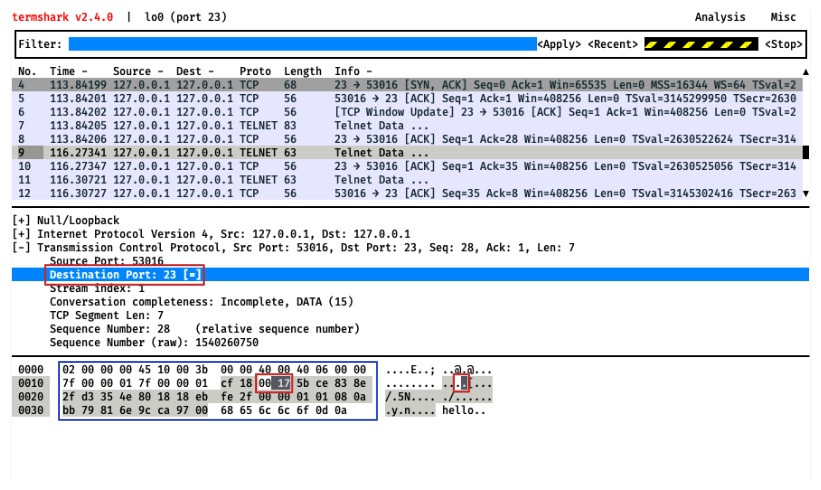

# Curl

Learn to explain how computers transmit structured data

[Video Alternative](https://www.youtube.com/watch?v=5dDqQWkEKzU&t=1031s)

## The question: How do computers transmit structured data?

We're going to explore how computers transmit structured data by examining one
of our packets a little bit closer.

So far we've seen how computers create virtual connections using packets. When
we looked at packets using `termshark` we also saw how they seemed to have a
structure to them. Let's look more at this:



In this image above I've highlighted the raw data in the packet in the bottom
panel with a blue outline. I've also highlighted a specific piece of data — the
destination port 23 — with a red outline.

<details>
  <summary>:speech_balloon: Remind me what a port is?</summary>

  ---

  A computer on a network has an IP address, for example `142.250.179.238`. To
  connect to that computer you need that IP address.

  But you also need to specify a 'port' _on_ that IP address to connect to.

  In the physical world if we want to plug a webcam into our computer we need to
  look at all of the different sockets our computer has on it and plug it into
  the right one. Some of these sockets might have specific purpose, while others
  might be multi-purpose.

  A network port is like that. Port 80 is used for HTTP connections, port 23 is
  used for `telnet`, and other ports don't have a specific purpose.

  There's nothing specific to stop a web server from accepting HTTP connections
  on port 23 or a `telnet` server from listening for connections on port 80.
  It's just a commonly agreed practice.

  [You can see a big list of all ports and the various purposes they have been
  put to here.](https://en.wikipedia.org/wiki/List_of_TCP_and_UDP_port_numbers)

  ---

</details>

There are three of these red outlines. This is because each one is just a
different way of looking at the underlying data. The closest we have to the
underlying data is the numbers within the blue outline.

Look closely at that red outline within the blue outline. It reads: `00 17`.
That's the port.

You may be surprised to see it is 17 and not 23 like in the middle panel. That
is because the data in the bottom panel is in hexadecimal ('hex'). You may be
familiar with binary being numbers expressed with 1s and 0s (base-2). Hex is
numbers expressed using 0, 1, 2, 3, 4, 5, 6, 7, 8, 9, A, B, C, D, E, and F (base-16).

We can convert hex (base-16) to decimal (base-10) by using [an online
converter.](https://www.binaryhexconverter.com/hex-to-decimal-converter). If you
do this, you will see that 17 in hex is 23 in decimal.

<details>
  <summary>:speech_balloon: Yeah, but how do you really do it?</summary>

  ---

  First, let's make a table of the digits from 0 to 15 in decimal and hex:

  | Hex     | 0   | 1   | 2   | 3   | 4   | 5   | 6   | 7   | 8   | 9   | A   | B   | C   | D   | E   | F   |
  | ------- | --- | --- | --- | --- | --- | --- | --- | --- | --- | --- | --- | --- | --- | --- | --- | --- |
  | Decimal | 0   | 1   | 2   | 3   | 4   | 5   | 6   | 7   | 8   | 9   | 10  | 11  | 12  | 13  | 14  | 15  |

  Let's say your number has four digits. You make a table where the columns
  are `16^3`, `16^2`, `16^1`, and `16^0`. Put the hex digits in a row below the
  columns and then the decimal equivalent of each digit in the next row.

  Consider the hex number `7A69`.

  |               | 16^3 (4096) | 16^2 (256) | 16^1 (16) | 16^0 (1) |
  | ------------- | ----------- | ---------- | --------- | -------- |
  | Hex digit     | 7           | A          | 6         | 9        |
  | Decimal digit | 7           | 10         | 6         | 9        |

  Then you multiply each decimal digit by the number in the column and add them all together:

  ```
  7 * 4096 + 10 * 256 + 6 * 16 + 9 * 1 = 31337
  ```

  To convert from decimal to hex, we take a different approach. We use division
  to divide the number by 16 and take the remainder. We convert the remainder to
  hex and that's our digit. Here's an example:

  ```python
  # Let 31337 be the number we want to convert to hex
  # First we check the remainder using modulo
  31337 % 16 = 9           # 9 is our rightmost digit            ___9
  (31337 - 9) / 16 = 1958  # 1958 is our new number to divide
  1958 % 16 = 6            # 6 is our next digit                 __69
  (1958 - 6) / 16 = 122    # 122 is our new number to divide
  122 % 16 = 10            # 10 is our next digit (hex: A)       _A69
  (122 - 0) / 16 = 7       # 7 is our new number to divide
  7 % 16 = 7               # 7 is our next digit                 7A69
  (7 - 7) / 16 = 0         # 0 is our new number to divide
  ```

  ---

</details>

But how does the computer know to look at that specific location to see the
destination port number?

The answer is something called a protocol. 

A protocol is a system of rules for interaction. Imagine if you were to be
called for jury duty or to give evidence in court. You might wonder what rules
you might need to follow or pay attention to. [Here is an example of a video
that explains some of these rules.](https://www.youtube.com/watch?v=5dNm6EYL1b0)
For example, all jurors need to take a sworn oath. We might call this a protocol
of behaviour for being inside a courtroom.

In computing, a protocol is a system of rules that two programs use to
communicate. If you look just above the red outline in the middle panel you can
see "Transmission Control Protocol" (TCP). This is an openly available set of
rules to allow computers on the Internet to transmit data to each other.

Here are some other protocols along with links to the documents outlining their (quite complex!) rules.

* UDP: [User Datagram Protocols](https://datatracker.ietf.org/doc/html/rfc768)
* TCP: [Transmission Control Protocol](https://datatracker.ietf.org/doc/html/rfc9293)
* Telnet: [Telnet Protocol](https://datatracker.ietf.org/doc/html/rfc854)
* HTTP: Hypertext Transfer Protocol (versions [1.0](https://datatracker.ietf.org/doc/html/rfc1945), [1.1](https://datatracker.ietf.org/doc/html/rfc9112) and [2](https://datatracker.ietf.org/doc/html/rfc9113))
* FTP: [File Transfer Protocol](https://datatracker.ietf.org/doc/html/rfc959)
* ICMP: [Internet Control Message Protocol](https://datatracker.ietf.org/doc/html/rfc792)
* IMAP: [Internet Message Access Protocol](https://datatracker.ietf.org/doc/html/rfc9051)
* TLS: [Transport Layer Security (version 1.3)](https://datatracker.ietf.org/doc/html/rfc8446), previously known as SSL.
* SSH: [Secure Shell Protocol](https://www.rfc-editor.org/rfc/rfc4253)

Each of these are a system of rules established for applications that want to
communicate over a network. You don't need to read the rules in detail, although
you might find it interesting to see how in depth they are.

## The tool: `curl`

You may have met `curl` before. We can use it to request files over the Internet
using HTTP. It also supports a number of other protocols. Let's look at two of
them using `curl`'s 'verbose' mode which gives more detail.

I'll annotate each part so you can see what it does. You don't need to learn the
details, just note that they are using structured approaches to communicate.

```shell
# HTTP: HyperText Transfer Protocol
; curl -vvv http://www.example.org
*   Trying 93.184.216.34:80...
* Connected to www.example.org (93.184.216.34) port 80 (#0)
  # HTTP uses port 80 by default
> GET / HTTP/1.1
  # Means: send a GET request to `/` using HTTP Protocol version 1.1
> Host: www.example.org
  # We tell the server which domain we're intending to make the request to. This
  # is because one server might actually host many domains.
> User-Agent: curl/7.79.1
  # We tell the server what software we're using to make the request.
> Accept: */*
  # We tell the server what kind of response we can receive. If we were
  # expecting a JSON response we might say `Accept: application/json`, but in
  # this case we're happy with anything.
>
* Mark bundle as not supporting multiuse
< HTTP/1.1 200 OK
  # The server responds with the HTTP protocol version it's using, the status
  # code and a message. 200 means the request was successful.
< Accept-Ranges: bytes
  # This header indicates that the server supports byte ranges. This means we
  # can ask for a specific part of the file rather than the whole thing.
< Age: 356236
  # This `Age` header indicates that the resource we've requested has been
  # 'cached'. Caching involves an intermediate server storing a copy of a
  # resource so that it can be served to other users more quickly. In this case
  # the intermediate server tells us that it last updated the cached copy 356236
  # seconds ago.
< Cache-Control: max-age=604800
  # This `Cache-Control` header tells us how long the resource can be cached by
  # the client so that we don't have to request it again. In this case it's 
  # 604800 seconds, which is 7 days.
< Content-Type: text/html; charset=UTF-8
  # This `Content-Type` header tells us what kind of data we're receiving. In
  # this case it's HTML and it represents characters using a system called
  # UTF-8.
< Date: Tue, 29 Nov 2022 11:30:48 GMT
  # This `Date` header tells us when the response was generated by the server.
  # So — the time the server believes it is now.
< Etag: "3147526947+ident"
  # This `Etag` header is a unique identifier for the resource. It's used to
  # check if the resource has changed since the last time we requested it.
< Expires: Tue, 06 Dec 2022 11:30:48 GMT
  # This `Expires` header tells us when the resource will expire and we'll need
  # to request it again. In this case it's 7 days after the `Date` header.
< Last-Modified: Thu, 17 Oct 2019 07:18:26 GMT
  # This `Last-Modified` header tells us when the resource was last modified.
  # This is actually surprisingly recent!
< Server: ECS (bsa/EB19)
  # This `Server` header tells us what software the server is using to respond.
  # In this case it's called ECS and it's a piece of software called 'Edge
  # Server' from a company called 'Amazon'.
< X-Cache: HIT
  # This `X-Cache` header tells us whether the resource was served from the
  # cache or not. 'HIT' means it was served from the cache, whereas 'MISS' means
  # it wasn't and had to be requested from the origin server.
< Content-Length: 1256
  # This `Content-Length` header tells us how many bytes we're going to receive
  # in the response body. This is so the client knows when the server is done 
  # sending the response.
<
<!doctype html>
<html>
<head>
    <title>Example Domain</title>

    <meta charset="utf-8" />
    <meta http-equiv="Content-type" content="text/html; charset=utf-8" />
    <meta name="viewport" content="width=device-width, initial-scale=1" />
    <style type="text/css">
    body {
        background-color: #f0f0f2;
        margin: 0;
        padding: 0;
        font-family: -apple-system, system-ui, BlinkMacSystemFont, "Segoe UI", "Open Sans", "Helvetica Neue", Helvetica, Arial, sans-serif;

    }
    div {
        width: 600px;
        margin: 5em auto;
        padding: 2em;
        background-color: #fdfdff;
        border-radius: 0.5em;
        box-shadow: 2px 3px 7px 2px rgba(0,0,0,0.02);
    }
    a:link, a:visited {
        color: #38488f;
        text-decoration: none;
    }
    @media (max-width: 700px) {
        div {
            margin: 0 auto;
            width: auto;
        }
    }
    </style>
</head>

<body>
<div>
    <h1>Example Domain</h1>
    <p>This domain is for use in illustrative examples in documents. You may use this
    domain in literature without prior coordination or asking for permission.</p>
    <p><a href="https://www.iana.org/domains/example">More information...</a></p>
</div>
</body>
</html>
  # This is the response body. It's the HTML document that we requested.
* Connection #0 to host www.example.org left intact
  # The connection was left open so we can make another request if we want.
```

We can break down this request into the following sections:

1. Client request
2. Client request headers
3. Server response headers
4. Server response body

These headers aren't directly what we look at as users of a web page, but they
are very useful for keeping the system operating effectively. Note that a lot of
the information here allows for caching, which is a way of avoiding costly
requests by storing previous ones and re-using them if they are still valid.

You may be wondering where `HTTPS` fits into this picture. We'll look at this
in a future step.

For now, let's look at a quite different protocol — FTP:

```shell
curl -vvv "ftp://ftp.bit.nl/OpenBSD/songs/song30.mp3" --output /tmp/song30.mp3
Trying 213.136.12.213:21...
* Connected to ftp.bit.nl (213.136.12.213) port 21 (#0)
  # We're connecting to the FTP server on port 21.
< 220 ProFTPD 1.3.5a Server (ftp.bit.nl) [::ffff:213.136.12.213]
  # The server responds by telling us the software it's using and its hostname.
> USER anonymous
  # We specify that our username is 'anonymous'.
< 331 Anonymous login ok, send your complete email address as your password
  # The server responds by telling us that we can log in as 'anonymous'.
  # We're not actually going to log in, but we need to send a password anyway.
> PASS ftp@example.com
  # We send our 'password'.
  # The server then sends us this informational message:
< 230-
< 230-
< 230-Dear "Security Researchers",
< 230-
< 230-Welcome to our *PUBLIC* OPEN SOURCE SOFTWARE MIRROR SERVER.
< 230-Please DO NOT report this under our responsible disclosure policy.
< 230-This is a PUBLIC service, with OPEN SOURCE SOFTWARE, and NOT a security threat to our company.
< 230-There is NO SENSITIVE INFORMATION on this server.
< 230-
< 230-Thanks.
< 230-
< 230-
< 230 Anonymous access granted, restrictions apply
  # We might guess that since open FTP servers are quite rare these days, this
  # FTP server's operators often get emails from 'security researchers' claiming
  # that they have found an open FTP server. This message kindly asks them to
  # stop, since there is no issue here!
> PWD
  # We send a command to get the current working directory.
< 257 "/" is the current directory
  # The server responds with the current working directory.
* Entry path is '/'
> CWD OpenBSD
  # We send a command to change the current working directory to 'OpenBSD'.
  # FTP works a bit like the terminal, in that we need to change directories
  # before we can access files.
* ftp_perform ends with SECONDARY: 0
< 250 CWD command successful
> CWD songs
  # We send another command to get into `OpenBSD/songs`.
< 250 CWD command successful
> EPSV
  # We send a command to ask the server to open a data connection for us to
  # use to download a file.
* Connect data stream passively
< 229 Entering Extended Passive Mode (|||52544|)
  # The server responds by telling us which port to connect to.
  # FTP has two modes for data connections: active and passive. Active mode
  # means that the server opens a connection to the client, whereas passive
  # mode means that the client opens a connection to the server. We're using
  # passive mode here. Passive mode is now the default because firewalls tend
  # to block incoming connections.
*   Trying 213.136.12.213:52544...
* Connecting to 213.136.12.213 (213.136.12.213) port 52544
* Connected to ftp.bit.nl (213.136.12.213) port 21 (#0)
> TYPE I
  # We send a command to tell the server that we want to download a binary file.
< 200 Type set to I
> SIZE song30.mp3
  # We send a command to ask the server how big the file is.
< 213 2898547
  # The server responds with the file size: 2,898,547 bytes or 2.8 MB.
> RETR song30.mp3
  # We send a command to tell the server that we want to download the file.
< 150 Opening BINARY mode data connection for song30.mp3 (2898547 bytes)
  # The server responds by telling us that it's going to start sending the
  # file.
* Maxdownload = -1
* Getting file with size: 2898547
{ [data] } 
# We download the file and save it to /tmp/song30.mp3.
* Remembering we are in dir "OpenBSD/songs/"
< 226 Transfer complete
# The server tells us that the transfer is complete.
* Connection #0 to host ftp.bit.nl left intact
```

If you'd like to hear a slightly strange piece of music themed around the
open source operating system OpenBSD, you can now play it with:

```
; afplay /tmp/song30.mp3
```

It's... somewhat catchy.

The rules for FTP are a bit different to HTTP, but one fact is unchanged: there
are rules that the client and server operate under in order to get their job
done. This is what a protocol is.

## Investigations

_These exercises are marked with :hot_pepper: emojis to denote how challenging
they are. A single chilli :hot_pepper: is the most straightforward, and five
:hot_pepper::hot_pepper::hot_pepper::hot_pepper::hot_pepper: would be
challenging even for a professional engineer. Pick whichever you prefer._

This is a set of questions you can investigate to learn more. Pick the ones that
interest you.

* :hot_pepper: What is TLS? When have you used it today?
* :hot_pepper::hot_pepper: What does BGP stand for? What is its purpose in the
  Internet?
* :hot_pepper::hot_pepper: What are the differences between HTTP/1.0, HTTP/1.1
  and HTTP/2?
* :hot_pepper::hot_pepper::hot_pepper: You can use some protocols manually using
  `telnet`. Read up on the `HTTP/1.1` protocol and see if you can use `telnet`
  to make a request to `http://www.example.org`.
* :hot_pepper::hot_pepper::hot_pepper: Without using a HTTP library, write a
  HTTP server that is fully featured enough to respond to requests from your web
  browser and have them displayed. For this you will need to understand the
  HTTP protocol, how to parse HTTP requests, and how to send responses.


[Next Challenge](05_dig_bite.md)

<!-- BEGIN GENERATED SECTION DO NOT EDIT -->

---

**How was this resource?**  
[😫](https://airtable.com/shrUJ3t7KLMqVRFKR?prefill_Repository=makersacademy%2Fcloud-deployment&prefill_File=01_internet%2F04_curl_bite.md&prefill_Sentiment=😫) [😕](https://airtable.com/shrUJ3t7KLMqVRFKR?prefill_Repository=makersacademy%2Fcloud-deployment&prefill_File=01_internet%2F04_curl_bite.md&prefill_Sentiment=😕) [😐](https://airtable.com/shrUJ3t7KLMqVRFKR?prefill_Repository=makersacademy%2Fcloud-deployment&prefill_File=01_internet%2F04_curl_bite.md&prefill_Sentiment=😐) [🙂](https://airtable.com/shrUJ3t7KLMqVRFKR?prefill_Repository=makersacademy%2Fcloud-deployment&prefill_File=01_internet%2F04_curl_bite.md&prefill_Sentiment=🙂) [😀](https://airtable.com/shrUJ3t7KLMqVRFKR?prefill_Repository=makersacademy%2Fcloud-deployment&prefill_File=01_internet%2F04_curl_bite.md&prefill_Sentiment=😀)  
Click an emoji to tell us.

<!-- END GENERATED SECTION DO NOT EDIT -->
