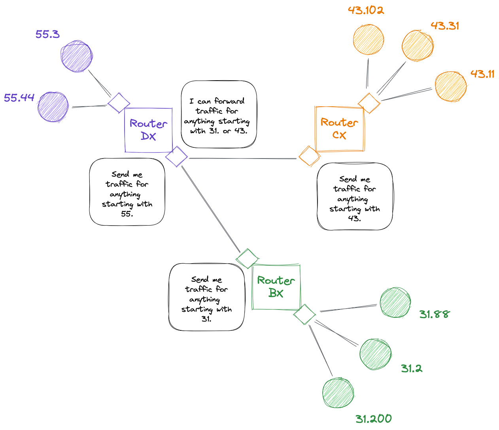

# Dig

Learn to explain how domain names get translated to addresses.

[Video Alternative](https://www.youtube.com/watch?v=Ivym1ZaBxfI&t=0s)

## The question: How does `example.org` get translated to an address?

Here are a couple of lines we've skipped over so far:

```shell
curl -vvv www.example.org
*   Trying 93.184.216.34:80...
* Connected to www.example.org (93.184.216.34) port 80 (#0)
```

We tell `curl` to make a request to `www.example.org`, but it actually makes a
connection to `93.184.216.34`. These two pieces of information are linked in
some way, but how?

First, let's look at that second piece of information: the IP address
`93.184.216.34`. We can analogise this number to a postal address:

```shell
Flat 5         # Identifies a specific abode
12 Main Street # Identifies a building, then a street
Tower Hamlets  # Identifies a district
London         # Identifies a city
UK             # Identifies a country
```

With an address, we start at the bottom with the broadest subdivision, and then
gradually divide it down into smaller and smaller units until one single house
is identified.

An IP address is similar to this — sort of.

Let's look at the structure of an IP address. It is four numbers from 0 to 255.
This means that there are 256 x 256 x 256 x 256 possible addresses — that's
4,294,967,296.

Batches of these IP addresses are allocated to countries, organisations, and
other purposes. These form sub-networks which know how to route to individual
computers. Let's look at a diagram:



> **Note**
> Real IP addresses use four segments, we're using two segments for brevity.
> Also note that the above lines are _real_ cables, not virtual ones.

In the above network, each router stakes a claim to specific groups of IP
addresses ('anything starting with 31.'). The wider network accepts this claim
and then routes packets through the network to that router. The router then
forwards on that traffic to the computer at the individual address.

For example, if machine 43.102 sends a packet to 31.88, it will first send it to
router CX, which will then forward it on to router DX, then BX which has claimed
responsibility for anything starting with 31., then that router will forward it
onto 31.88.

<details>
  <summary>:speech_balloon: How do routers work out what routes are best?</summary>

  ---

  This is done using something called BGP — Border Gateway Protocol.
  
  It is another topic entirely, but simplified: routers on the internet connect
  to their neighbours and make claims. In the above example, BX sends a message
  to DX saying "if you have packets for 31.x, send them to BX".

  DX then adds this to its routing table. When it gets packets in future for
  anything starting with 31, it will forward them to BX.
  
  It then performs a second action. It a message to its neighbour CX saying "if
  you have packets for 31.x, send them to DX who will then send them to BX".

  CX then adds this route to its routing table. When it gets packets in future
  for anything starting with 31, it will forward them to DX on the understanding
  that DX can forward them to BX.

  If, later, an engineer wires up a cable between CX and BX, then router BX will
  advertise directly to CX and while CX will know that it can send traffic via
  DX if needed, it will prefer the shorter route.

  There are many other sources of information that can go into route
  preferences, including business relationships between Internet companies.

  ---

</details>

So that's how packets get to IP addresses, but if routers work with IP addresses
how do packets get to a domain name like `www.example.org`? 

The answer is something called DNS — the Domain Name System. DNS is a system for
looking up the IP addresses for domain names. It does this by contacting a
server called a resolver and sending it a special lookup request. The resolver
then responds with the IP address.

When I make a request to `www.example.org`, the first thing `curl` will do is
contact a resolver to get `www.example.org`s IP address, and then send the
request packets to that IP address.

<details>
  <summary>:speech_balloon: So how do we know the IP address of the resolver?</summary>

  ---

  Your Internet provider (e.g. British Telecom) has their own resolver and will
  tell your home router its IP address.

  You can tell your computer to use a different resolver, typically run by a big
  company. They often have memorable IP addresses like `8.8.8.8` (run by
  Google), or `1.1.1.1` (run by Cloudflare).

  Why do they do this? They have their own reasons. But you do have to use one,
  so if you control the computer you get to decide whose it is.

  ---
</details>

<details>
  <summary>:speech_balloon: Who tells the resolver what the IP address for a particular domain is?</summary>

  ---

  When someone purchases a domain name (e.g. `makers.tech`) they enter into an
  indirect agreement with an organisation who maintains the top-level domain
  (TLD), in this case `.tech`. 
  
  That organisation (called a registry) maintains an authoritative name server
  which can be queried to find out the IP address (or another server to go to in
  order to find out the IP address) of a particular domain name.

  ---

</details>

Let's look at a tool to find out more about DNS records.

## The tools: `nslookup` and `dig`

If we just want to find out the IP address for a particular domain, we can use
`nslookup`, like so:

```shell
; nslookup example.org
# This is the address of our resolver, not of example.org
Server:    192.168.6.1
Address:   192.168.6.1#53 # Port 53 is the port for DNS

# Below is the address of example.org
Non-authoritative answer:
Name:	example.org
Address: 93.184.216.34
```

So the IP address of `example.org` is `93.184.216.34`.

> **Note**  
> Your lines might be a bit different due to your router's DNS server maybe
> having a different IP address, and potentially `example.org` having multiple
> IP addresses that we can use to request its content.

That's good. But what if we wanted to take a closer look at the DNS records
associated with `example.org`, say for example if we needed to debug a problem.
For this we can use `dig`.

`dig` allows us to query the DNS records associated with a particular domain.
There are a number of possible record types. One important one is an `A` record,
which dictates one or more IP addresses for the domain.

```shell
# Get 'A' records for 'example.org'
; dig example.org A

; <<>> DiG 9.10.6 <<>> example.org A
;; global options: +cmd
;; Got answer:
;; ->>HEADER<<- opcode: QUERY, status: NOERROR, id: 48269
;; flags: qr rd ra; QUERY: 1, ANSWER: 1, AUTHORITY: 0, ADDITIONAL: 0

;; QUESTION SECTION:
;example.org.	              IN    A

;; ANSWER SECTION:
example.org.        28521   IN    A    93.184.216.34

;; Query time: 78 msec
;; SERVER: 192.168.8.1#53(192.168.8.1)
;; WHEN: Sat Dec 03 13:12:19 GMT 2022
;; MSG SIZE  rcvd: 45
```

You can see the IP address against the single `A` record in the `ANSWER SECTION`.

You'll notice in the `nslookup` output there was a line saying
'Non-authoritative answer'. This means that our DNS server (in this case, my
local router) isn't the authoritative source for information about
`example.org`. It's just repeating what it has heard from another source,
assuming that it is correct.

However, what if it recently changed? We might want to go straight to the
authoritative nameserver for that domain. For that, we need to know what it is,
and for this, we can look at the `NS` record.

```shell
; dig example.org NS
; <<>> DiG 9.10.6 <<>> example.org NS
;; global options: +cmd
;; Got answer:
;; ->>HEADER<<- opcode: QUERY, status: NOERROR, id: 4583
;; flags: qr rd ra; QUERY: 1, ANSWER: 2, AUTHORITY: 0, ADDITIONAL: 5

;; OPT PSEUDOSECTION:
; EDNS: version: 0, flags:; udp: 4096
;; QUESTION SECTION:
;example.org.	                 IN    NS

;; ANSWER SECTION:
example.org.           3052    IN    NS      a.iana-servers.net.
example.org.           3052    IN    NS      b.iana-servers.net.

;; ADDITIONAL SECTION:
a.iana-servers.net.    1626    IN    A       199.43.135.53
b.iana-servers.net.    139275  IN    A       199.43.133.53
a.iana-servers.net.    1626    IN    AAAA    2001:500:8f::53
b.iana-servers.net.    139275  IN    AAAA    2001:500:8d::53

;; Query time: 94 msec
;; SERVER: 192.168.8.1#53(192.168.8.1)
;; WHEN: Sat Dec 03 13:16:38 GMT 2022
;; MSG SIZE  rcvd: 176
```

Here, `dig` has told us that the nameservers for `example.org` are
`a.iana-servers.net` and `b.iana-servers.net` (there are two for redundancy). It
has also helpfully provided their IP addresses in an `ADDITIONAL SECTION`
beneath.

Let's use `nslookup` to look up `example.org` directly from
`a.iana-servers.net`.

```shell
# To specify a DNS server to use, we pass it as the second argument
; nslookup example.org a.iana-servers.net
Server:   a.iana-servers.net
Address:  199.43.135.53#53

Name:    example.org
Address: 93.184.216.34
```

Note that we now don't have that 'Non-authoritative answer' line, because we're
now asking the main authority for that domain name.

## Investigations

_These exercises are marked with :hot_pepper: emojis to denote how challenging
they are. A single chilli :hot_pepper: is the most straightforward, and five
:hot_pepper::hot_pepper::hot_pepper::hot_pepper::hot_pepper: would be
challenging even for a professional engineer. Pick whichever you prefer._

This is a set of questions you can investigate to learn more. Pick the ones that
interest you.

* :hot_pepper: What is a `CNAME` record for?
* :hot_pepper: What is an `MX` record for?
* :hot_pepper::hot_pepper: What is a `TXT` record for? Can you find some
  examples for real domains out there?
* :hot_pepper::hot_pepper: What packets do `nslookup` and `dig` generate? Can
  you look at them using `termshark`?
* :hot_pepper::hot_pepper::hot_pepper: What is an `AAAA` record for? How does it
  fit into the growth of the Internet?


[Next Challenge](06_mkcert_bite.md)

<!-- BEGIN GENERATED SECTION DO NOT EDIT -->

---

**How was this resource?**  
[😫](https://airtable.com/shrUJ3t7KLMqVRFKR?prefill_Repository=makersacademy%2Fcloud-deployment&prefill_File=01_internet%2F05_dig_bite.md&prefill_Sentiment=😫) [😕](https://airtable.com/shrUJ3t7KLMqVRFKR?prefill_Repository=makersacademy%2Fcloud-deployment&prefill_File=01_internet%2F05_dig_bite.md&prefill_Sentiment=😕) [😐](https://airtable.com/shrUJ3t7KLMqVRFKR?prefill_Repository=makersacademy%2Fcloud-deployment&prefill_File=01_internet%2F05_dig_bite.md&prefill_Sentiment=😐) [🙂](https://airtable.com/shrUJ3t7KLMqVRFKR?prefill_Repository=makersacademy%2Fcloud-deployment&prefill_File=01_internet%2F05_dig_bite.md&prefill_Sentiment=🙂) [😀](https://airtable.com/shrUJ3t7KLMqVRFKR?prefill_Repository=makersacademy%2Fcloud-deployment&prefill_File=01_internet%2F05_dig_bite.md&prefill_Sentiment=😀)  
Click an emoji to tell us.

<!-- END GENERATED SECTION DO NOT EDIT -->
