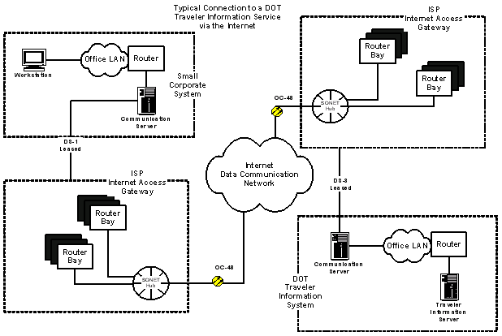

# Docker

Learn to explain what the cloud is

[Video Alternative](https://www.youtube.com/watch?v=Ivym1ZaBxfI&t=1492s)

## The question: What is the cloud?

To understand the cloud, we need to look at the not-cloud. So what is the
not-cloud?

To put it simply, the not-cloud is computer hardware. It's anything you can
touch. Your laptop in front of you isn't the cloud. If you've ever seen a
network room in your office or school then that's not the cloud. Your home
router isn't the cloud.

It used to be that if you wanted to put a website on the Internet, you'd need
to:

1. Get some money.
2. Go to the computer shop.
3. Buy a computer sufficiently powerful to run your server given your expected
   traffic.
4. Put it in your car.
5. Drive it to a data center: a company who had a powerful Internet connection
   and a room suitable for putting server computers in it.
6. Pay the data center for the privilege of putting your server there.
7. Hook it up to the power and network cables.
8. Plug a monitor into it (you remembered to buy one right?).
9. Set up the computer.
10. Put your software on it and run that software.
11. Unhook the monitor and then drive home.

And if it ever broke down, say the hard-drive was faulty, you'd need to drive
there — possibly in the middle of the night — and try to fix it. It was a huge
hassle!

Over time technology was devised to make servers easier to maintain. SSH to
allow you to log in remotely, remote operating panels to allow you to physically
switch computers off and on, and eventually data centres would provide services
to maintain your servers for you (so long as it didn't involve intimate
knowledge of your system).

One day someone had the bright idea to put multiple websites on one computer.
They would set up a few servers and then sell space on those servers and a way
to isolate your files from others. This was called shared hosting. The problem
was that if one person's website got very popular or they made a coding mistake
then all the other websites might get very slow.

Still — shared hosting was a way of _abstracting away the computer hardware_.
You would just rent some space and rely on the person you paid to figure out the
details.

Due to the downsides of shared hosting, another system was developed — Virtual
Private Servers (VPS). A company would buy a few very powerful servers and use
them to simulate tens or hundreds of less powerful servers. Each VPS would act
as if it was one computer. You could log into it, use the terminal, start and
close programs, and all the usual things you could do on a computer. Resources
would also be reserved so that one couldn't overload the rest.

VPS was another way of _abstracting away computer hardware_. You would rent a
VPS and it would be almost exactly like a real computer but all the details of
managing the hardware would be abstracted away from you.

This is the start of what we'd call the cloud. It's called 'the cloud' in
reference to the use of clouds as a symbol in network diagrams. Here's an
example:



In this diagram, the cloud in the center is standing in for _waves hand_ the
Internet. It's too complicated, detailed, and not relevant right now so
engineers would just draw a cloud. The cloud icon represented an abstraction —
we won't worry about what's going on here, just that traffic will go in and come
out again. It was often used to represent "the Internet".

Cloud computing emerged from this abstraction. Where's the web server running?
Well, somewhere _out there_. We don't care where — we pay someone else to care
about that. We just care that it is running.

We saw abstraction before earlier in the module. We saw how packet switching is
used to simulate direct connections between computers by breaking down
communication into tiny bits and routing them across a network. 

The cloud is this idea taken to the extreme — total abstraction from computer
hardware in favour of virtual systems in order to achieve a high degree of
flexibility.

Computing is full of this idea of abstraction, of things that are not real but
virtual. There is no real 'desktop', you are not really 'connected' to your WiFi
router, there are no ports, sockets, addresses, packets. In the cloud, [virtual
servers](https://aws.amazon.com/ec2/) with [virtual hard
drives](https://docs.aws.amazon.com/AWSEC2/latest/UserGuide/AmazonEBS.html) are
connected over a [virtual network](https://aws.amazon.com/vpc/). Even some of
the [people](https://aws.amazon.com/lex/) are virtual.

Cool right? [A bit scary,](https://www.youtube.com/watch?v=-k6rhm17j4A) but
cool. In any case, lots to learn.

We're going to put all this into practice now with a tool called Docker.

## The tool: `docker`

Start by [installing Docker](https://www.docker.com).

When you're done, run this:

```shell
; docker --help
Usage:  docker [OPTIONS] COMMAND

A self-sufficient runtime for containers
# ...
```

Let's break that down:

* A runtime is a program that runs other programs.
* A container is an executable package of software that includes everything
  needed to run an application: its code, settings, the programming language
  executable, the system tools and libraries necessary to run that executable,
  and anything else needed.
* Self-sufficient means that it doesn't need anything else to run.

You can think of a container as a virtual machine (virtual computer). It's not
exactly that, but it is a good analogy for now.

<details>
  <summary>:speech_balloon: What are they really if not a virtual computer?</summary>

  ---

  A container isn't actually a virtual computer, it's more of a virtual
  environment that we can run programs in. This might seem like a subtle
  difference, and it is.

  The difference is that a virtual computer — sometimes called virtualisation —
  involves simulating the hardware of a computer. Docker doesn't do that.
  Instead, Docker uses the hardware of the computer it is on but packages up all
  of the environment that each program needs and runs it just like it was one
  single program.

  This _is_ a fairly subtle distinction so don't worry about it too much.

  ---

</details>

<details>
  <summary>:speech_balloon: And why are they called containers?</summary>

  ---

  They are called containers in an analogy to a shipping container. Shipping
  containers are a standardised way of shipping goods. They are the same size,
  shape, and have the same fittings. This means that the international shipping
  system can broadly ignore what's inside and treat them all in the same way.

  This is what containerised software is designed to achieve. You can take your
  software, package it up in a standardised way, and then send it to your cloud
  host. That host can totally ignore the specifics of your software and treat it
  in the same way as any other containerised software.

  ---

</details>

We'll use Docker in the next phase to containerise our own software, but for now
let's try using it to run a few applications.

You might have heard of the Linux operating system. It is a free & open source
operating system and quite friendly for software engineers. It is also used on a
lot of production servers. It is in some ways similar to macOS (and this
similarity is one of the reasons Macs are popular amongst software engineers).

Let's run Linux using Docker:

```shell
# Ubuntu is a kind ('distribution') of Linux
; docker run -it ubuntu /bin/bash
root@b4ff79fcfc88:/#
```

<details>
  <summary>:confused: I see 'Cannot connect to the Docker daemon at ...'</summary>

  ---

  You'll need to start Docker and keep it running for as long as you're using it.
  It should be in your Applications folder.

  If you keep running into trouble, contact your coach.

  ---

</details>

That's given you a new terminal. Run `ls` and take a look around.

You can also install packages using the Ubuntu package manager `apt`. Let's try
it:

```shell
# We'll update the package sources
; apt update

# We'll install 'cowsay', a program that speaks from the perspective of a cow
; apt install cowsay

; /usr/games/cowsay "Moo!"
; /usr/games/cowsay -f tux "Hello, I am running on Linux!"
```

Now type `exit` to leave the container. You can verify that you're back on your
main computer.

```shell
; apt
The operation couldn’t be completed. Unable to locate a Java Runtime that supports apt.
Please visit http://www.java.com for information on installing Java.

; /usr/games/cowsay
zsh: no such file or directory: /usr/games/cowsay
```

In the next phase, you'll use Docker in a more powerful way. You'll package up
your own software by wrapping it in a container.

## Investigations

_These exercises are marked with :hot_pepper: emojis to denote how challenging
they are. A single chilli :hot_pepper: is the most straightforward, and five
:hot_pepper::hot_pepper::hot_pepper::hot_pepper::hot_pepper: would be
challenging even for a professional engineer. Pick whichever you prefer._

This is a set of questions you can investigate to learn more. Pick the ones that
interest you.

* :hot_pepper: How do you run a container in the background?
* :hot_pepper: How do you stop a container running in the background?
* :hot_pepper: If you save a file in the Linux Docker container, then quit the
  container, then start it again — is the file still there?
* :hot_pepper::hot_pepper: How can you make files outside of the container
  accessible inside the container?
* :hot_pepper::hot_pepper: How can you persist files within a Docker container?
* :hot_pepper::hot_pepper: Docker can in principle containerise any application.
  Can you find any other interesting or useful containers out there?
* :hot_pepper::hot_pepper: What is a VS Code Dev Container? How can they support
  you and your teams to build software?
* :hot_pepper::hot_pepper::hot_pepper: Not all programs can run on all
  computers. Why is this? How does Docker handle this problem?


<!-- BEGIN GENERATED SECTION DO NOT EDIT -->

---

**How was this resource?**  
[😫](https://airtable.com/shrUJ3t7KLMqVRFKR?prefill_Repository=makersacademy%2Fcloud-deployment&prefill_File=01_internet%2F07_docker_bite.md&prefill_Sentiment=😫) [😕](https://airtable.com/shrUJ3t7KLMqVRFKR?prefill_Repository=makersacademy%2Fcloud-deployment&prefill_File=01_internet%2F07_docker_bite.md&prefill_Sentiment=😕) [😐](https://airtable.com/shrUJ3t7KLMqVRFKR?prefill_Repository=makersacademy%2Fcloud-deployment&prefill_File=01_internet%2F07_docker_bite.md&prefill_Sentiment=😐) [🙂](https://airtable.com/shrUJ3t7KLMqVRFKR?prefill_Repository=makersacademy%2Fcloud-deployment&prefill_File=01_internet%2F07_docker_bite.md&prefill_Sentiment=🙂) [😀](https://airtable.com/shrUJ3t7KLMqVRFKR?prefill_Repository=makersacademy%2Fcloud-deployment&prefill_File=01_internet%2F07_docker_bite.md&prefill_Sentiment=😀)  
Click an emoji to tell us.

<!-- END GENERATED SECTION DO NOT EDIT -->
