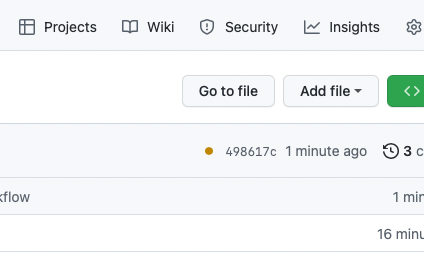

# Continuous Integration

In this phase we will take a web application and set up Continuous Integration
and Continuous Deployment. In this step we will set up CI.

## Objective

Learn to explain what continuous integration is and why it is used.

## Guidance

[Video Alternative](https://youtu.be/HvWFctd5Usc)

When most people say Continuous Integration, they mean one thing:

When a developer pushes new code to the codebase, a system will notice this,
download it, run the tests, and tell the developer if they failed.

Continuous Integration is a funny way to say that though. The history is useful
to know so we will discuss it briefly.

When a software developer wants to implement a change to a codebase, they will
typically follow this process:

1. Clone the git repository.

2. **Create a new 'branch' for their work**  
   This branch will contain just their commits and not any new ones that are
   committed by other developers. This allows them to focus on their changes
   without distraction even in very large teams.

3. Write their code, committing regularly.

4. **Make a 'pull' request to merge their changes into the main branch**  
   The developer requests that the changes on their branch be added to the main
   branch that everyone works from. This is so their work can be built on by
   others and, hopefully, shipped to users.

5. **Another engineer sees if their code is good to merge.**  
   This is the critical step for us. We'll come back to it.

6. **The code is merged, possibly after a round of feedback and changes.**  
   From now on, all new branches will also include our developer's work, and
   it will be shipped to users at the next deploy.

Steps five and six together are called **integration**. Integration is the
moment when the code that has branched off is _integrated_ back into the main
codebase.

Integration used to be a big slowdown. Many things could go wrong. For example:

* **The main codebase might have changed a lot since the branch-off.**  
  This would mean 'merge conflicts' — the main codebase and the branch might
  have changed in conflicting ways that would need to be integrated.

* **The developer's work might not meet the required standard**  
  It may need substantial corrections, or possibly even require rethinking from
  scratch.

* **The developer may not have included sufficient tests for their work.**  
  This became a huge issue when combined with the first point above. If the
  developer has been working with code that's very different from the main
  branch and they are about to be integrated — there's essentially no guarantee
  that anything will work afterwards.

The answer is a set of practices called continuous integration — CI. The core
idea is to make integration quick and easy so that it can happen very often and
avoid any long-lived branches.

CI usually includes these practices:

1. **Developers should merge their work into the main branch very regularly.**  
   Perhaps even once per day, or even more often.

2. **Developers should include automated tests for everything.**  

3. **The full test suite should be run automatically before and after merge.**  
   This will make integration faster since engineers will have more confidence
   that the system is working. It will also catch defects introduced in the
   process of bringing the two branches together.

So that's Continuous Integration.

Step three requires some infrastructure. We are going to set up that
infrastructure.

We're going to use the [`codebases/simple_server`](../codebases/simple_server)
codebase for this exercise. That is because running CI with a database is a
little more complex.

<details>
  <summary>:speech_balloon: Too complex for me?</summary>

  ---

  No — you'll be able to do it. After this phase you're welcome to work on
  setting up CI-CD with an application that has a database. It's just that we'll
  start with the simpler version.

  ---

</details>

Clone this repo if you haven't already, and copy the `codebases/simple_server`
folder to a directory somewhere:

```shell
# Let's get a copy of it
; cp -a codebases/simple_server ~/where_your_code_lives/simple_server_ci
; cd ~/where_your_code_lives/simple_server_ci

# And set it up
; pipenv install
; pipenv shell
; pytest
```

Now let's get it tracked and uploaded to Github:

```shell
; git init .
; git add .
; git commit -m "Initial commit"

# If you want to use Github through the web, go and create a new repo and
# follow the instructions to push this repository.

# If you have and want to use the Github CLI:
; gh repo create --private --source=. simple_server_ci
; git push -u origin main
```

Now we're ready to get started setting up the test running part of CI.

For this we're going to use a tool called [Github
Actions](https://docs.github.com/en/actions). It is enabled by default and is
set up through a config file in a special place in the repository. The config
file uses a configuration syntax called YAML.

Put this contents in `.github/workflows/main.yml`:

```yaml
# The name of the workflow
name: Build and Test

# This workflow will run on any push to the repository
on: push

jobs:
  test:
    # Similar to docker, we set up a virtual machine to run our tests
    runs-on: ubuntu-latest

    steps:
      # Each step has a name, some code, and some options
      - name: Check out the code
        uses: actions/checkout@v3 # This is a reference to some code to run

      # This step installs the Python version we want
      - name: Set up Python 3.11
        uses: actions/setup-python@v4
        with:
          python-version: 3.11

      # This step installs pip, pipenv, and our dependencies
      - name: Install dependencies
        run: | # Note that there's no reference here — just commands to run
          python -m pip install --upgrade pip
          pip install pipenv
          pipenv install --dev
      
      # Now we run our tests
      - name: Test with pytest
        run: |
          pipenv run pytest
```

Then commit and push

```shell
; git add .
; git commit -m "Add CI config"
; git push
```

Now open up your repository in your web browser. Next to the latest commit there
should be a little dot — either green (passed), orange (in progress) or red
(failed).



Click that dot. Then click 'Details'. You will see the CI workflow has run. It
should also have passed if everything is set up correctly.

<details>
  <summary>:speech_balloon: I can't find it!</summary>

  ---

  If you can't find it, open your repository home page, hit `cmd+f`, and search
  for 'Actions'. Click the Actions tab and you will then be able to click into
  the runs and workflows.

  ---

</details>

You've set up CI! Congrats.

## Exercise

Let's try out a mini version of continuous integration.

1. Create a new branch in your local repository.
2. Make some changes to make a test fail.
3. Commit and push those changes to a remote branch.
4. Create a pull (merge) request.
5. See that the build has failed and you'll need to fix your failure.
6. Fix the failure.
7. Commit the fix.
8. Push the fix (to the same branch).
9. See the PR update, the build run and pass.
10. Merge the changes.
11. See the workflow pass on the main branch after integration.

<details>
  <summary>:confused: How do I create a branch?</summary>

  ---

  ```shell
  ; git checkout -b your-branch-name
  ```

  ---

</details>

<details>
  <summary>:confused: How do I push to the remote branch?</summary>

  ---

  ```shell
  git push -u origin your-branch-name
  ```

  ---

</details>

<details>
  <summary>:confused: How do make a pull request?</summary>

  ---

  When you push your changes it will give you a link to submit a pull request.

  If you can't find it, open up your repository and look for the 'Pull Requests'
  tab. There should be a notice in there, or you can create a new PR for your
  branch with the big green button.

  ---

</details>


[Next Challenge](02_cd.md)

<!-- BEGIN GENERATED SECTION DO NOT EDIT -->

---

**How was this resource?**  
[😫](https://airtable.com/shrUJ3t7KLMqVRFKR?prefill_Repository=makersacademy%2Fcloud-deployment&prefill_File=03_shipping%2F01_ci.md&prefill_Sentiment=😫) [😕](https://airtable.com/shrUJ3t7KLMqVRFKR?prefill_Repository=makersacademy%2Fcloud-deployment&prefill_File=03_shipping%2F01_ci.md&prefill_Sentiment=😕) [😐](https://airtable.com/shrUJ3t7KLMqVRFKR?prefill_Repository=makersacademy%2Fcloud-deployment&prefill_File=03_shipping%2F01_ci.md&prefill_Sentiment=😐) [🙂](https://airtable.com/shrUJ3t7KLMqVRFKR?prefill_Repository=makersacademy%2Fcloud-deployment&prefill_File=03_shipping%2F01_ci.md&prefill_Sentiment=🙂) [😀](https://airtable.com/shrUJ3t7KLMqVRFKR?prefill_Repository=makersacademy%2Fcloud-deployment&prefill_File=03_shipping%2F01_ci.md&prefill_Sentiment=😀)  
Click an emoji to tell us.

<!-- END GENERATED SECTION DO NOT EDIT -->
